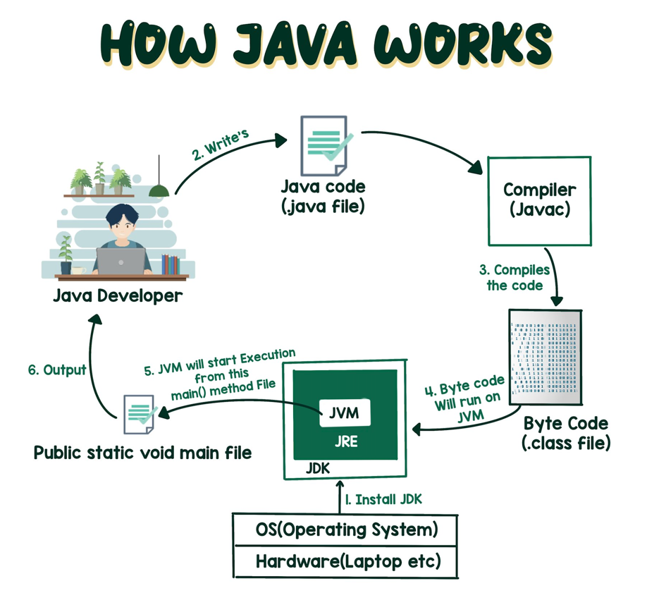

## JVM Architecture Diagram

ref: https://dzone.com/articles/jvm-architecture-explained

## An overview of the software development process.

## Through the Java VM, the same application is capable of running on multiple platforms.

ref: https://docs.oracle.com/javase/tutorial/getStarted/intro/definition.html

## How java works

## 额外想说的
- 笔记
- 图