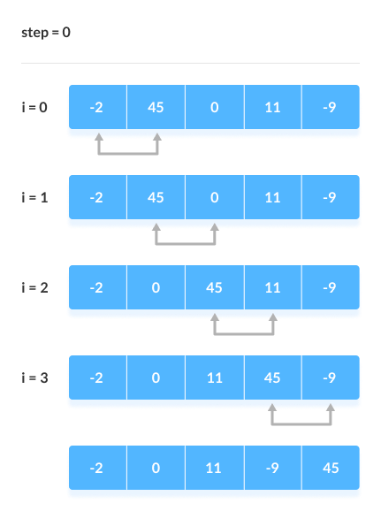
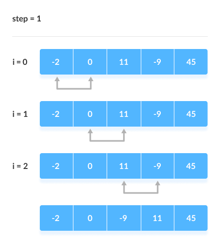
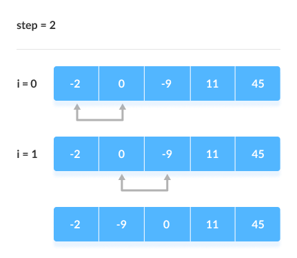
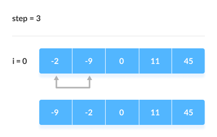

## 冒泡排序

## Array 小结
### 数组的介绍

### 一维数组
  - 数组的声明和初始化
  - 访问数组元素
  - 数组的大小
  - 数组遍历
    - 增强 for 循环
  - 数组元素初始化值
  - 内存解析

### 二维数组
一维数组的元素，又是一维数组

### 基于数组的算法

### Arrays 工具类

### 数组常见异常

### 多维
//int[][][] md = new int[][][];