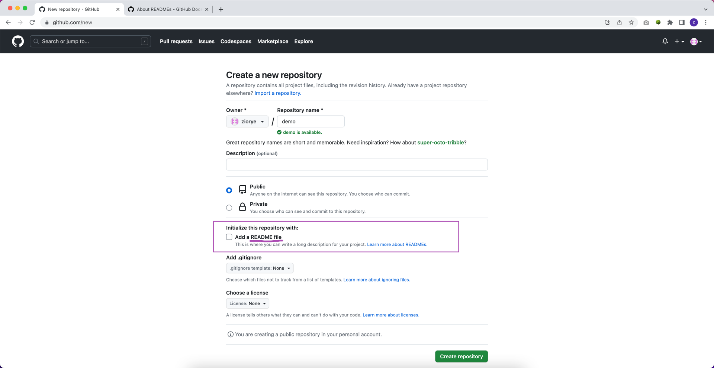
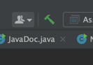
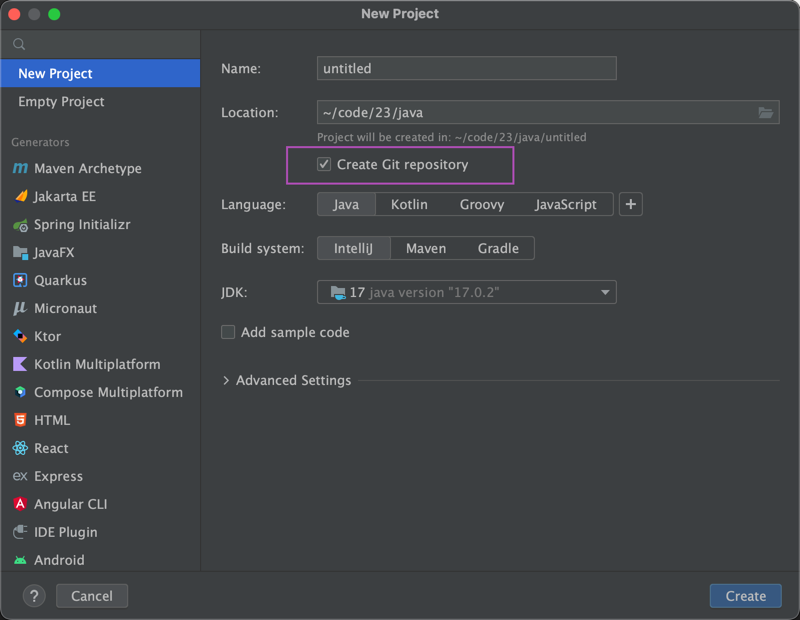
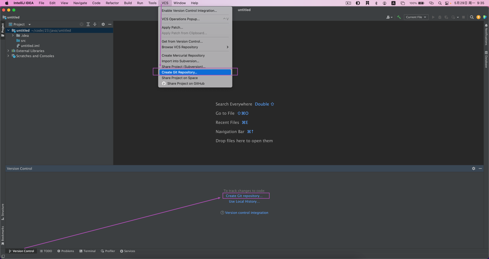
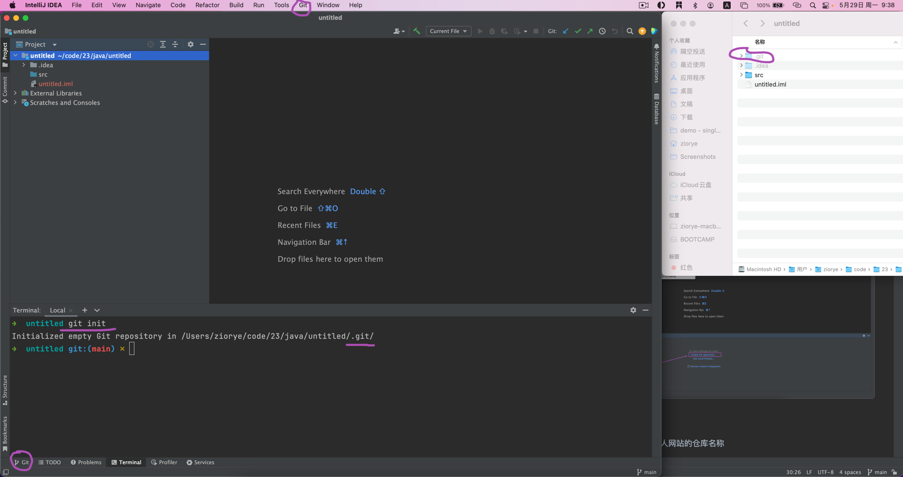
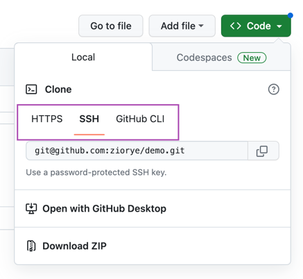
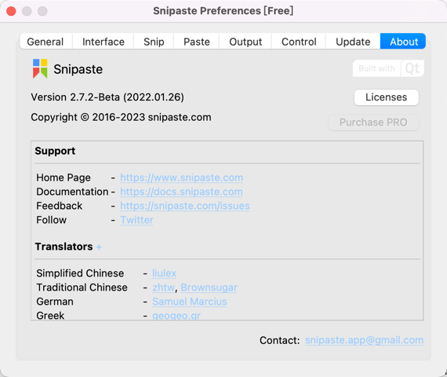

## 快速复习
### Markdown Cheat Sheet
https://www.markdownguide.org/cheat-sheet/

### 第一个 Java 程序
```java
public class HelloWorld {
    public static void main(String[] args) {
        System.out.println("Hello World!");
    }
}
```
#### 编译
*重点关注*
`javac HelloWorld.java`
#### 运行
`java HelloWorld`
### IDEA 编辑器安装及使用






### GitHub 注册与使用
ssh 免密登录
[userame].github.io 个人网站的仓库名称

...or push an existing repository from the command line
```shell
git remote add origin git@github.com:[username]/iae.git
git branch -M main
git push -u origin main
```


### Git 安装与使用
- git bash
- git config --global user.name 'your-name'
- git config --global user.email 'your-email'
- git init
- git clone [仓库地址 https/ssh]
- 
- git push

### 截屏软件


https://www.snipaste.com/
### Task List
- [x] Write the press release
- [ ] Update the website
- [ ] Contact the media

