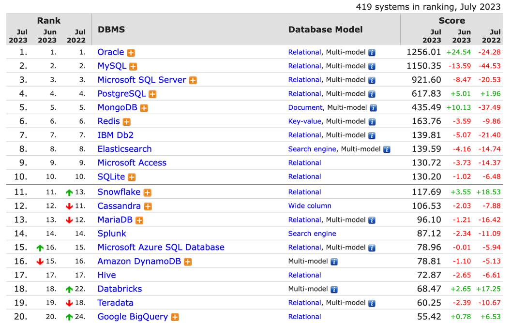
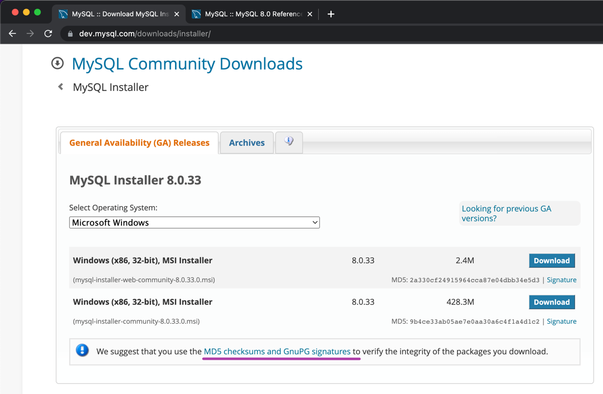
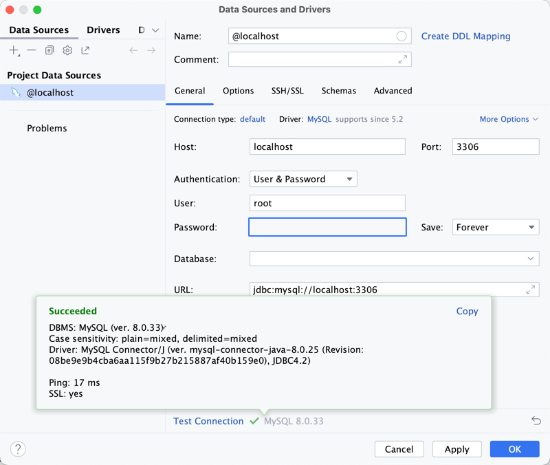
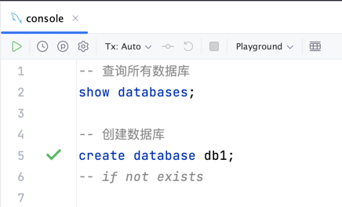
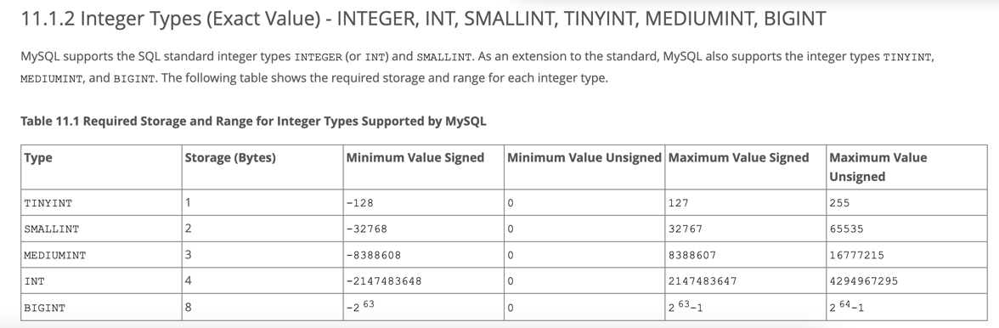
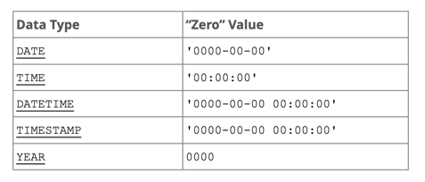
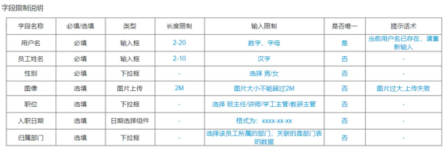

# Mysql

## Why Mysql?
### 存储
- 内存
- 文件
- 专业的存储软件
### 主流数据库软件
DB-Engines Ranking
https://db-engines.com/en/ranking


## Download

- https://www.mysql.com/
- downloads
- MySQL Community (GPL) Downloads
  - Windows: MySQL Installer for Windows
  - macOS: MySQL Community Server
    - arm64
    - x86
- No thanks, just start my download.
## MD5 checksums and GnuPG signatures

- md5 mysql-8.0.33-macos13-x86_64.dmg
```shell
➜  Downloads md5 mysql-8.0.33-macos13-x86_64.dmg
MD5 (mysql-8.0.33-macos13-x86_64.dmg) = a317234944b483d045bb80d5c0e27b31
➜  Downloads
```

## Install
...

## Connecting to and Disconnecting from the Server
https://dev.mysql.com/doc/refman/8.0/en/connecting-disconnecting.html

## Entering Queries
`SELECT VERSION(), CURRENT_DATE;`

## Overview of the MySQL Database Management System
https://dev.mysql.com/doc/refman/8.0/en/what-is.html
### What is MySQL?
- MySQL is a database management system
  - /usr/local/mysql/bin/mysql -uroot -psecret
  - /usr/local/mysql/bin/mysql -uroot -p
- MySQL databases are relational
- MySQL software is Open Source
- The MySQL Database Server is very fast, reliable, scalable, and easy to use
- MySQL Server works in client/server or embedded systems
### The Main Features of MySQL
### History of MySQL

## SQL 
The SQL part of “MySQL” stands for “Structured Query Language”.

SQL is the most common standardized language used to access databases. Depending on your programming environment, you might enter SQL directly (for example, to generate reports), embed SQL statements into code written in another language, or use a language-specific API that hides the SQL syntax.

SQL is defined by the ANSI/ISO SQL Standard. The SQL standard has been evolving since 1986 and several versions exist. In this manual, “SQL-92” refers to the standard released in 1992, “SQL:1999” refers to the standard released in 1999, and “SQL:2003” refers to the current version of the standard. We use the phrase “the SQL standard” to mean the current version of the SQL Standard at any time.

### 注释 
- `-- 单行注释`
- `/* 多行注释 */`
### SQL 分类
- DDL: Data definition language
  https://dev.mysql.com/doc/refman/8.0/en/glossary.html#glos_ddl
- DML: Data manipulation language
  https://dev.mysql.com/doc/refman/8.0/en/glossary.html#glos_dml
- DCL: Data control language
  https://dev.mysql.com/doc/refman/8.0/en/glossary.html#glos_dcl

#### DDL (数据库操作)
- 查询
  - show databases; -- 查询所有数据库
  - show database();/SELECT DATABASE(); -- 查询当前数据库
- 使用
  - use 数据库名; -- 使用数据库
- 创建
  - create database [if not exists] 数据库名; -- 创建数据库
- 删除
  - drop database [if exists] 数据库名; -- 删除数据库
> `database` <-> `schema`

## 图形化工具
Database -> New -> Data Source -> MySQL


Download missing driver files
Test Connection


1 of ***


console


rename file

### DDL (表操作)
-- 创建表
create table 表名(
    字段1 字段类型 [约束] [comment 字段1注释],
    ...
    字段n 字段类型 [约束] [comment 字段n注释]
)[comment 表注释];

```sql
create table tb_user(
  id int comment 'ID, 唯一标识',
  username varchar(20) comment '用户名',
  name varchar(10) comment '姓名',
  age int comment '年龄',
  gender char(1) comment '性别'
) comment '用户表';
```

- 约束
  - 非空约束 not null
  - 唯一约束 unique
  - 主键约束 primary key
  - 默认约束 default
  - 外键约束 foreign key

```sql
create table tb_user(
  id int primary key comment 'ID, 唯一标识',
  username varchar(20) not null unique comment '用户名',
  name varchar(10) not null comment '姓名',
  age int comment '年龄',
  gender char(1) default '男' comment '性别'
) comment '用户表';
```

`auto_increment`


## MySQL 常见数据类型
### 数值类型
https://dev.mysql.com/doc/refman/8.0/en/integer-types.html

### 字符类型
https://dev.mysql.com/doc/refman/8.0/en/char.html

### 日期时间类型
https://dev.mysql.com/doc/refman/8.0/en/date-and-time-types.html

https://dev.mysql.com/doc/refman/8.0/en/date-and-time-type-syntax.html
A timestamp. The range is '1970-01-01 00:00:01.000000' UTC to '2038-01-19 03:14:07.999999' UTC.
TIMESTAMP values are stored as the number of seconds since the epoch ('1970-01-01 00:00:00' UTC).

## 练习

-- 图形化界面创建表 tb_emp
```sql
create table tb_emp(
  id int primary key auto_increment comment '主键ID',
  username    varchar(20)                  not null comment '用户名',
  password    varchar(32) default '123456' null comment '密码',
  name        varchar(10)                  not null comment '姓名',
  gender      tinyint unsigned             not null comment '性别, 1 男, 2 女',
  image       varchar(300)                 null comment '图像url',
  job         tinyint unsigned             null comment '职位, 1 班主任 , 2 讲师 , 3 学工主管, 4 教研主管',
  entrydate   date                         null comment '入职日期',
  create_time datetime                     not null comment '创建时间',
  update_time datetime                     not null comment '修改时间',
  constraint tb_emp_username_uindex unique (username)
) comment '员工表';
```

ref: demo.sql
